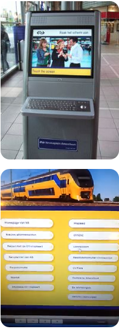
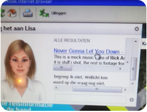

Title: That one time XSS came in handy
Author: dsc
Date: 2012-10-12 10:22
Tags: responsible disclosure
Slug: that-one-time-xss-came-in-handy

Because I am too lazy to ride a bike for longer than 30 seconds I used to take the bus to work with the downside of having to wait 35 minutes on the local central station for the next bus. A sacrifice I was willing to make considering I wasn’t doing any physical labor.

One day when I arrived at the central station I noticed 5 newly placed computers and a printer in the main lobby. As I still had quite some time left until my next bus departed I decided to check them out.

### Kiosk software

The computers were bolted into the ground, keyboard embedded into a titanium frame and the same for the trackball mouse. They probably didn’t want anything destructive happen to them since they’d be out there day and night.

The machines would be idle on a portal (website) that featured 15 travel related websites. This was around the time our train system was making the transition from physical paper tickets to an electronic ticket based on NFC technology, dubbed the "OV-chipkaart". In line with with these ambitions `ns.nl` provided computers for travelers to make use of.

{: .pull-left}

### Sandbox

As I was poking around to see what kind of operating system it was running I found out it was running Windows Vista with a sandboxed browser. Whenever I would try to do anything even remotely not what the machine was originally intended for it would give you a friendly ‘fuckoff’ pop-up and return back to the portal page. 

The few things it did have were: a restricted Internet Explorer (without an URL bar) with a locked down ‘save document’ option to save documents that you could later print out, using Adobe Reader. It also seemed to have Flash player.

### Hunting for vulnerabilities

As previously mentioned, every day I had about 35 minutes to waste, looking for vulnerabilities on the websites that were available to me within this 'intranet' seemed like a good way to spend my time. 

I quickly found that `connexxion.nl` seemed to suffer from XSS. I usually don't care about XSS, but then I realized I could maybe include YouTube in an `<iframe>` and watch videos while waiting!

But... The sandbox blocked YouTube. And Google... And a bunch of other websites. I concluded that the sandboxed browser is subject to a domain blacklist.

The search engine Bing seemed to work and so did Vimeo and a couple of other video streaming websites like Metacafe, which entertained me for a few days. 

Eventually I walked up to the check-in counter to tell them about what I had found and left my telephone number.   

### Deeper down the rabbithole

Days went by and every morning I would listen to music, maybe watch some Quake matches from tournaments in fullscreen while waiting for my bus. You could turn the music pretty loud as the systems were built for public places after all. After a week and a half I was wondering if my complaint even got passed along so I tried again.

{: .pull-right}

One day, while I was watching videos I found a way to bypass the sandbox. Turns out, this sandbox is a total piece of shit and could be circumvented easily through the Adobe Flash web player.

When you right-click on an Adobe Flash movie you can go into into the settings manager. From there you can go to Security Options and 'add locations to trust' (?). When you click on “add a location” it spawns a FileDialog browser. A thing we already had while saving documents to the locked down `Documents` folder but this time with elevated permissions to view the whole system. That’s cute!  

During these FileDialog shenanigans, the sandbox process was still running. That meant that it would still actively prevent you from launching processes with a blacklisted name (I think) - so creating `hax.bat` and opening it in command prompt was not possible.

### Fingerprinting

By looking at files and directories, I concluded the following:

- Windows 7 32bit
- SiteKiosk 7.8 Build 332
- Internet Explorer: IE 9.0.8112.16421
- Adobe Flash ActiveX 10.3.183.5
- Adobe Reader ( Not sure what version )
- Teamviewer 5.1.10408 ( License: 1000, ID: 671******, User Account: SYSTEM )
- 5/0.5mbit via KPN 3G ( Bcast: 192.168.1.255 )
- A HP Laserjet P2055X printer on the network
- Most of this software was outdated.

### Juicy files

For some reason I found emails in `html` format on the disk. Emails like `Can you send me the logo in .eps format` and `What should we do with the welcome page` being sent back and forth between different `ns.nl` employees, obviously concerning the machines. The emails were in the `version` folder inside the `portal/web` directory which implies they got wrongfully included during deployment.

And now for the most juicy file I could find: `SiteKiosk Login.txt` and it contained, you guessed it, a password for the SiteKiosk sandbox in plaintext. 

### Key to the kingdom

Now that I had the password, I had no idea how to get to a login prompt from within the sandbox. I definitely didn't feel like installing `SiteKiosk` at home to find out so instead I hunted down the configuration files and opened them in notepad. Scrolled a bit through it and saw they were blacklisting all kinds of stuff. I wondered what the impact really was of blacklisting around 40 websites. Hardcoded solutions are seldom good and easily circumvented. 

    :::xml
    <url allowed="false">file://${Windir)\*.ht*</url>
    <url allowed="false">file://$(UserProfile)\*.ht*</url>
    <url allowed="false">file://$(AllUserProfile)\*Microsoft*\*.ht*</url>
    <url allowed="true">file://$(SiteKioskPath)\*</url>
    <url allowed="true">file://$(SiteKioskPath)\html\*</url>
    <url allowed="true">file://$(SiteKioskPath)\skins\public\*</url>
    <url allowed="true">http://www.ns.nl</url>
    <url allowed="true">https://www.ns.nl</url>
    <url allowed="false">http://www.google.nl</url>
    <url allowed="false">http://www.youtube.nl</url>
    <url allowed="false">http://www.nu.nl</url>
    <url allowed="false">http://www.marktplaats.nl</url>
    <url allowed="true">http://www.ov-chipkaart.nl</url>
    <url allowed="true">http://www.nshispeed.nl/nl/internationale-treinplanner</url>
    <url allowed="true">http://eropuit.nl</url>
    <url allowed="true">http://plannerint.b-rail.be</url>
    [...]

These configuration files were pretty big and I couldn’t think of a quick and easy way to send or paste it somewhere. The clipboard was all messed up and I had to do everything in a 200×200 XSS’d window in terms of web-browsing on a malfunctioning trackball mouse.

So, I printed out `config.xml` on the spot and that resulted in a steady stream of around 30 pages pooping out of the printer. While I was waiting for the printer to complete I had other people waiting by it as it is generally being used to print out travel related information. They must’ve thought I was making one hell of a trip!

### Back to business

Back to my goal; watch YouTube. I altered the configuration file to allow `youtube.com`. The only problem was reloading the config. The machines were always on, even at night. 

After some time I came across the installer for SiteKiosk on disk. Great. So I’d run the installer, select “fix installation” and it wouldnt do anything but check the core files (not the configuration) and most importantly restart Windows.

Now, the process of restarting Windows was painfully slow. It took about 5-7 minutes. SiteKiosk installs itself pretty ‘deep’ in the operating system in order to directly take it over after launching Windows. After booting you get some command shells doing all kinds of stuff in the installation process. After that a pop-up from SiteKiosk with a progressbar appears and finally some virusscanner installs itself.

### uh-oh

When doing this, I went to a store next to the machine to get a milkshake and watch the machine reboot from there. 2 `ns.nl` employees walked passed and noticed what was happening to the machine, they were witnessing a steady stream of multiple command shells pooping out all kinds of output.

I quickly made my way out because I didn’t want to be caught in the moment `\:D/` and luckily there was a bus ready to leave, somewhat in the direction I needed to go. As the bus was passing by the lobby I saw about 10-12 `ns.nl` employees staring at the screen wondering what was happening.

The next day I could finally watch YouTube in full glory!

### The End

It took 4 reports and 2 months to fix it. I got called by `connexxion.nl`, told them to fix their XSS. I sent some explanation to `ns.nl` and they promptly hired an external security consultant from the company `dhv.nl` ([whose website also seems to be vulnerable to XSS](http://i.imgur.com/sl4JZ.png) ... the irony). The kiosks themselfs came from a company called `diz.nl`, which focusses on service-kiosk solutions.

I ended up receiving 2 first-class traintickets, both for a whole day.

#### Media

- [ns1.png](../images/ns1.png)
- [ns2.png](../images/ns2.png)
- [ns3.png](../images/ns3.png)
- [ns4.jpg](../images/ns4.jpg)
- [ns5.jpg](../images/ns5.jpg)
- [ns6.png](../images/ns6.png)
- [ns7.jpg](../images/ns7.jpg)
